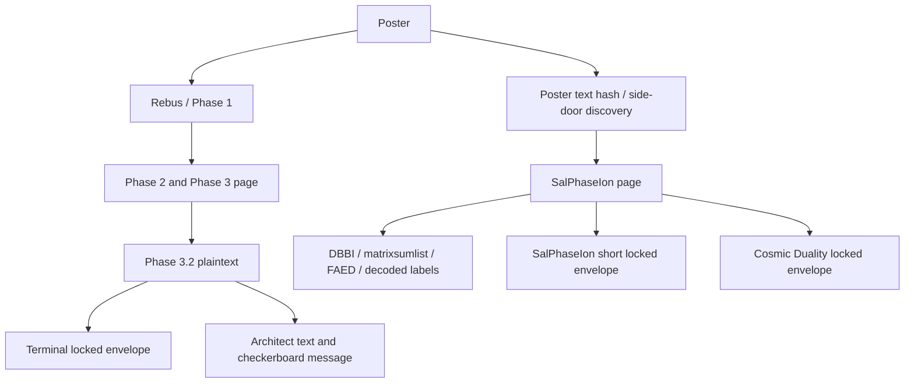

# Locked-envelope context and solving strategy

**Verdict:** the working ciphertexts and default decryption convention check out. The weak point is deriving the next password from its actual instructions. Broader plaintext inspection is useful protection against missed intermediates, but does not by itself move that derivation forward. No envelope was opened in this review.

This review uses local original HTML, decoded stage bytes, selected original Telegram messages with their surrounding questions, and the prior experiment reports. `tools/audit_envelope_context.py` reproduces the checks and writes `runs/2026-09-13_envelope_context/verified_context.json` and `source_messages.json`. It does not rewrite puzzle data.

## 1. What is mechanically established

I reopened all three solved envelopes from their source material and matched their full plaintexts to the saved files:

| Stage | Plaintext bytes | Padding | How its answer is constructed |
|---|---:|---:|---|
| Phase 2 | 648 | 8 | One riddle answer: causality |
| Phase 3 | 4090 | 6 | Seven separately derived parts, concatenated in specified order, then hashed |
| Phase 3.2 | 2422 | 10 | Three riddle answers concatenated, then hashed |

All use AES-256-CBC, SHA-256 hex of the answer as passphrase, legacy EVP_BytesToKey with SHA-256, and PKCS#7. The original Phase 2 page explicitly names AES-256-CBC and hashing, and says `parts 1..7 --> sha-256 -> dgst is the password`. The Phase 3 plaintext says the next envelope uses that convention “yet again.”

The forwarded creator statement #33445 says the same software was used in every phase. That supports continuity, but software can support multiple settings. The default is strongly justified by reproducible earlier decryptions; its application to the locked stages remains an extrapolation until one opens. `Salted__` alone does not identify every algorithm or KDF parameter.

I separately re-extracted the three locked blobs from their actual containing sources. Every byte matches the current working envelopes, including the easily lost `z` in SalPhaseIon and the full two-line Terminal blob. A current loader truncation is not the obstacle.

## 2. The puzzle branches; the envelope order is not established

This depicts source containment/discovery, not a claimed password dependency. The audio clue supplies HASHTHETEXT on the side-door route; that does not require opening Terminal. No authenticated edge yet connects one locked envelope's plaintext to another's password.

In #8566–8569 the creator appears to answer three questions in order: Terminal is still locked; it is not the location of the requested SalPhaseIon hint; he will not clarify the allegedly unused Norton/X2SH material. The lack of reply links warrants the usual caveat, but the exchange does not support making Terminal a required gateway to SalPhaseIon.

“Cosmic Duality” is an actual heading in the original page, not merely an analyst's nickname. The barrystyle image depicts a cosmic yin-yang motif. His #8312 says he googled a phrase he assumed was part of a hint, and the creator calls the result specific. That supports a thematic connection. It does not prove the image supplies a password, that viewing the heading means reaching yingyang, or which AES blob must open first. #39237 calls yingyang the next phase in response to a question about AES; it does not name a blob or specify a plaintext format.

## 3. Each envelope needs its own source-grounded hypothesis

| Envelope | Closest evidence | Best justified working question | What is not established |
|---|---|---|---|
| Terminal | Phase 3.2 intro, modified Architect speech, checkerboard message about Half/Better Half, final blob | What instruction or unfinished operation in this branch derives its password? | That it directly holds one complete key, or must open first |
| SalPhaseIon short | DBBI and FAED with mixed-encoding labels immediately beside it | How do these fields specify the answer and its construction? | DBBI is a SHA digest; every label names a password part; any particular matrix shape |
| Cosmic Duality | Separate heading and long ciphertext on the same page; thematic creator responses | Is its password supplied by a preceding decode or by material already present? | That it is the final stage, that it requires MD5, or that its plaintext is only keys |

SalPhaseIon has the densest local instruction context and is therefore my first priority for **derivation work**. This is a research priority, not an imposed solve order. Keep Terminal as a separate branch and cheaply check a well-derived answer against the other envelopes without treating that cross-check as evidence for its origin.

## 4. The SalPhaseIon instructions are partly decoded, not fully understood

Re-derived from the original spaced stream:

`DBBI | matrixsumlist | FAED | lastwordsbeforearchichoice | thispassword | shabefourfirsthintisyourlastcommand | ciphertext line 1 | enter | ciphertext line 2 | shabefanstoo`

Supported readings:

- The page's letter digits make `shabef` read as sha256. The shared prefix supports the split `shabef | ourfirsthintisyourlastcommand`.
- `enter` lies at the exact boundary between the two 64-character base64 lines. A line-break instruction is a strong economical reading.
- “last words before archi choice” points toward an Architect/choice referent, and “thispassword” explicitly discusses password construction.

Unresolved readings:

- Does `matrixsumlist` label DBBI, label FAED, or specify an operation connecting them?
- Is a field an input, output, checksum, password component, or instruction?
- Which choice is intended: the film's act of choosing, a choice utterance, or the modified puzzle's selection instruction?
- Does `anstoo` mean to hash an additional answer, or merely reiterate hashing? A common prefix does not settle this suffix's complete semantics.

Earlier stages demonstrate **composite answers and explicit formatting rules**. It is therefore unsafe to equate every recognizable label with a standalone password. Conversely, the earlier seven parts do not authorize seven arbitrary new components or all their permutations. A composite hypothesis needs a reason for its components, their order, and where hashing occurs.

Message #8446 independently decodes to an **unseparated** string beginning `yellowblueprimesmatrixsumlistlastwordsbeforearchichoiceyinyang...`. The recognizable order is real. Treating it as seven numbered parts or a formally prescribed algorithm is an interpretation. It raises the priority of a connection among colour/primes, matrix sums and the Architect clue without specifying that connection.

## 5. Evidence that should guide, but not dictate, a model

- **Primes:** #8000, #8330 and the accidental-hint exchange #5963–5969 support their relevance. They do not prescribe DBBI as the operand, a 7×13 grid, or replacing every prime-position character with zero. #8330 follows a solver's matrix-sum question, which strengthens the contextual connection without supplying an algorithm.
- **479 → PRIVATEKEY:** reproducible earlier arithmetic provides a useful anchor. Its next operation is unknown. Matching an index is not a password derivation.
- **DBBI's 64-token/16-symbol parse:** useful optional checksum hypothesis. A match could strongly validate that model; absence of a match does not invalidate an otherwise supported envelope answer.
- **“Salvation” feeling:** #6497 describes the experience of progressing in the phase. It is not a requirement that decrypted bytes contain religious language, the word salvation, or any particular emotional tone.
- **Regular private key / checkerboard message:** supports checking both target addresses. Does not require every intermediate plaintext to contain such a key.

The modified Architect speech ends before the film's complete doors discussion and contains no literal CHOICE. Existing notes that name a single exact “last words” answer overstate an unresolved reference. Multiple interpretations have been tested as literal strings, with no authenticated result; that does not establish that literal quoting is the intended operation.

## 6. Length constraints narrow format hypotheses legitimately

Under AES-CBC/PKCS#7, Terminal and SalPhaseIon short each contain 64–79 plaintext bytes. Cosmic contains 1312–1327 bytes.

For either short envelope:

| Proposed entire plaintext | Bytes | Fits? |
|---|---:|---|
| Bare raw private scalar | 32 | No |
| Bare WIF | 51 or 52 | No |
| 64-character hex value | 64 | Yes |
| Same hex value + LF / CRLF | 65 / 66 | Yes |
| Two raw 32-byte values | 64 | Yes |
| WIF with additional material | Depends | Possibly |
| The other existing short envelope, raw | 96 | No |

A 64-hex value could also be another password/digest rather than a private key. Equal short-envelope sizes do not establish equal plaintexts or a relationship between their keys.

The 755 recovered outputs all have padding 1 or 2, so the short ones are 79 or 78 bytes. They cannot be exactly a bare 64-character value or that value plus only LF/CRLF under the tested convention. They can still be other intermediate formats. Their current unresolved retention is correct; making them the central search target is not supported by additional evidence yet.

## 7. How to proceed correctly

For each new experiment, record this chain before generating many candidates:

1. **Source:** exact bytes, page field or message; identify the intended envelope.
2. **Interpretation:** state which material is input and which instruction acts on it.
3. **Transformation:** specify indexing, matrix shape, alphabet, ordering and normalization. Explain each choice from the source or label it an explicit alternative.
4. **Password construction:** distinguish answer text, concatenated components, digest bytes, digest hex and the OpenSSL passphrase. Use the proven single outer SHA-256 first; avoid accidental extra hashing.
5. **Test and retain:** complete ciphertext, known profile, all padding-valid bytes and provenance. L5 runs independently. Format recognizers assist inspection and never eliminate unknown bytes.
6. **Validate a promising result:** require a coherent message, a reproducible next operation, an independent relation to another artifact, or a target-key match. Re-encrypting with the same key verifies bookkeeping, not authenticity.

The next useful experiment should compare the **role assignments of the SalPhaseIon fields**, including the possibility of multiple components, before adding more matrix transforms. A successful model should explain substantial input rather than extract a lucky short word. This review identifies the needed experiment specification; it does not claim to have supplied its missing transform.

Keep alternate cipher/KDF sweeps secondary and explicit. There is currently more source evidence for an unfinished answer-construction step than for abandoning the proven encryption convention. Continue preserving the 755; revisit a particular output when a new context-based transform predicts how to interpret it, rather than applying unlimited transforms to every random-looking body.

## 8. Corrections to the working narrative

The major corrections are: branch structure is not solve order; the short-envelope WIF hypothesis needs additional material; L5 is optional; a feeling-of-salvation remark is not a plaintext filter; and “0 notable” is not proof no correct intermediate decrypt occurred.

I corrected the explicit overclaims in 01, 03, 08 and 09. Historical experiment files remain intact. These changes preserve the useful tests while narrowing their conclusions to what was actually established. We have a better-supported method, not a solved missing step.
