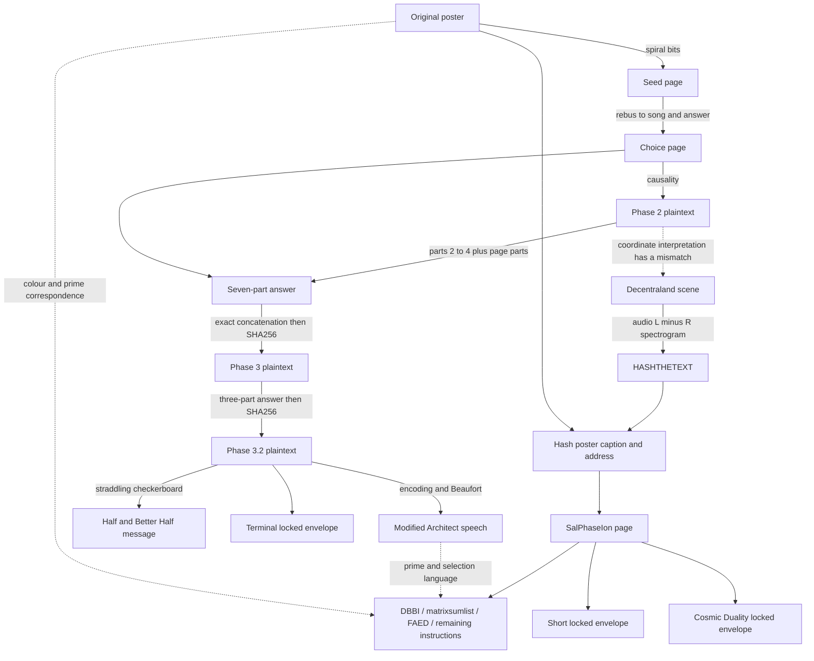

# Whole-puzzle direction audit — 2026-09-13

**Finding:** the solved chain remains sound, but the research has repeatedly mistaken “recognizable clue” for “completed operation,” and sometimes mistaken an already-explained clue for unused final-stage material. The strongest remaining direction is the connection between the original poster's colours, DBBI's prime structure, and the complete SalPhaseIon instruction stream. This is a ranked research conclusion, not a solved recipe. No locked envelope opened.

## 1. Reconstructed route and where verification stops

Solid arrows show established connections or explicit source containment; the rebus/song and audio reading rely on the reviewed source evidence rather than a fresh audio transcription. Dashed arrows are interpretations with unresolved details. Containment is not a password dependency.

Fresh `tools/audit_whole_puzzle.py` checks reproduce the three complete AES plaintexts (648, 4090 and 2422 bytes), all 1539 Architect letters, all 91 checkerboard letters, the SalPhaseIon labels, caption hash and three locked blobs. `runs/2026-09-13_whole_puzzle/verified_connections.json` preserves the results. The original poster and four relevant rebus tiles were also inspected visually; the earlier media review was consulted, not replaced by a claim of exhaustive new media analysis.

## 2. A concrete correction: “Raising the stakes…” has a plausible existing job

The exact original sentence is `Raising the stakes without extra chances of winning.` It immediately precedes the board/alphabet instruction.

A **straddle** is a blind poker bet that raises the amount required to enter the pot, commonly doubling the big blind. This gives a strong contextual wordplay explanation for **straddling checkerboard**, the cipher that actually decodes the adjacent 149 digits into a complete coherent message. The poker term was checked against [PokerStars' explanation](https://www.pokerstars.uk/poker/learn/news/what-is-a-straddle-in-poker-and-when-should-you-use-it/). This is an inference about puzzle intent; betting changes game dynamics, so the sentence is not a mathematically exact claim about all winning probabilities.

Older ledgers assert that the first sentence “has never been consumed by anything” and use it to speculate that Terminal is a side prize or unrelated stakes increase. That assertion is too strong. The straddle interpretation connects the wording to an independently successful local decode without inventing a new transform. A secondary meaning is possible but needs evidence.

Likewise `One for one, four for one` has the community-supported **1141 -> EBCDIC 1141** interpretation. Earlier notes tying it exclusively to checkerboard row prefixes were incomplete. The encoding and checkerboard should be treated as successful local constructions, not as universal parameters for FAED.

## 3. Clue accounting across the entire available route

| Material | Established role | Still unverified |
|---|---|---|
| Poster black/blue vs white/yellow | Complete URL through the 14×14 spiral | Off-white anomaly and later uses of colour/geometry |
| Rebus tiles, locks, plus/minus glyphs | Word construction pointing to The Warning / Logic; accepted lyric-derived answer | Any second-layer sign rule; a blue plus and red minus do not assign signs to blue/yellow primes |
| Phase 2 causality clue | Opens first AES and is part one of next answer | No reason to interpret every later choice reference as the same literal answer |
| SafeNet / Luna / HSM, EO number, genesis source and chess | Exact remaining parts of the seven-part answer | A secondary use is possible but cannot be assumed merely because the material is evocative |
| X2SH strip | Four defined substitutions support an X-row/Y-row coordinate reading | Candidate (-42,-16) misses recorded scene parcels (-41,-16), (-41,-17); full four-stop route not established |
| Q riddle's QWERTYUIOP | Ten-column keyboard gives I/W -> 8/2 in the coordinate interpretation | Possible referent for “as wide as the first one seen,” not proven |
| Decentraland audio | L−R reveals HASHTHETEXT; caption hash identifies SalPhaseIon | A second audio message is not established; source code names the audio and builds the question mark |
| Fresco / Alice / uncertainty riddles | Exact three-part answer opens Phase 3.2 | Philosophical or book references as a final cipher input remain hypotheses |
| Architect introduction and classical block | EBCDIC conversion, Beaufort and a complete rewritten speech | Meaning of added reinsertion/selection/brute-force instructions |
| Board instruction and 149 digits | Complete straddling-checkerboard message | Unused table cells and “first board” referent; no Terminal password follows automatically |
| SalPhaseIon binary and decimal layers | Exact labels and two ciphertext halves separated by encoded `enter` | Field roles, operations, component order and scope of hashes |
| Creator colour/prime hints | Corroborate the poster/prime connection | Numerical signs, matrix shape, summing direction and correction of mismatches |
| Creator zeroing hint | Some zeroing is required somewhere along the route | Operand, representation and phase |
| Cosmic Duality heading and barrystyle image | Actual heading; acknowledged thematic connection | Which plaintext reaches yingyang, password and further operation |

The X/Y strip should not be discarded, but it should also not be called necessarily unused: it has a supported navigational role. Earlier notes in this workspace contain both claims. The verified scene metadata records the discrepancy rather than resolving it by proximity.

## 4. What the puzzle itself demonstrates about failed searches

I retested **all ten known-correct components** from the seven-part and three-part answers as isolated passwords. Every one failed; both correct concatenations still opened their complete plaintexts. This is a positive-control demonstration of a real methodological problem: “does not open AES alone” is not a valid rejection rule for an intermediate clue answer.

The legacy first-block ASCII filter is another demonstrated blind spot. Correct earlier plaintext contains non-ASCII material, and a short padding length is not a valid rejection rule. The expanded inspector and retained-output journals protect against those errors; they have not authenticated the 755 recovered outputs.

Conversely, readable prefixes do not validate long cipher outputs. HILL, BTCSEED, IFINDO, ZERO and YOUWON each have specific constructions and limitations already recorded. They do not collectively establish one coherent chain. A successful downstream reconstruction would be qualitatively stronger evidence than another word found under adjustable choices.

## 5. The actual remaining bottleneck

The first **765** SalPhaseIon characters are one uninterrupted a–i run. The first explicit `z` separator follows FAED. Decoding the embedded 104-bit section as `matrixsumlist` establishes a useful partition, but does not prove that cipher state resets at the 91/195 boundaries or that DBBI and FAED are independent password components.

The strongest joint evidence is:

1. Original poem directs attention back to the poster and explicitly distinguishes blue/yellow numbers.
2. Original Architect rewrite calls for prime reinsertion and changes the nouns around 23/16/7.
3. DBBI's full 84-cell parse independently reproduces 23 prime cells split into 16 b and 7 be, while the 83-cell alternate ending remains possible. *(14 §M1: the count 23 is `π(84)`, so only the 16/7 split and the parse's existence are evidence — the latter is strong: 0/20,000 shuffle controls parse.)*
4. The page's own decimal-letter convention supplies b/be -> 2/25 -> B/Y as a colour interpretation.
5. Creator #8446 places `yellowblueprimesmatrixsumlistlastwordsbeforearchichoice` consecutively in a decoded message.

These jointly favor a structured derivation involving existing data. They do **not** specify signed prime numbers, 7×12, modulo 26, a Hill cipher, or a quotation used literally as a password. The colour match remains 22/23 with an unpaired 24th poster marker; neither discrepancy should be erased to force the model.

The highest-priority question is therefore: **what complete transformation of the SalPhaseIon stream explains both the prime-marked material and the Architect-labelled material, with a defensible boundary between its steps?** The preceding direct field, sum, quote and zeroing tests constrain only their declared models. A putative answer must reconstruct substantial untouched source data or a complete plaintext and account explicitly for exceptional characters. Until then, retain competing field roles rather than committing to an arbitrary cipher and compensating with more password guesses.

## 6. Limits and corrections to the working index

Years unsolved do not establish a single simple mistake, nor prove the original puzzle is error-free. The creator admitted testing an earlier erroneous string repeatedly; his assurances are useful context but not independent cryptographic validation. Current source copies match our working inputs, which rules out several present transcription errors but cannot prove the author's intended recipe.

This audit covers the original captured pages, poster, representative rebus graphics, all saved decrypted text, the verified solve chain, the main and side-route evidence, creator context catalogs and prior experiment reports. It does not claim fresh exhaustive steganalysis of every media file, access to the creator's private solution, or an opening of any locked envelope.

Older reports remain historical records. In particular, the L5 DBBI digest pattern is optional, Terminal-first is unproven, no ASCII/padding heuristic is a universal success gate, and the straddle explanation supersedes the claim that “Raising the stakes…” necessarily has no solved role.
